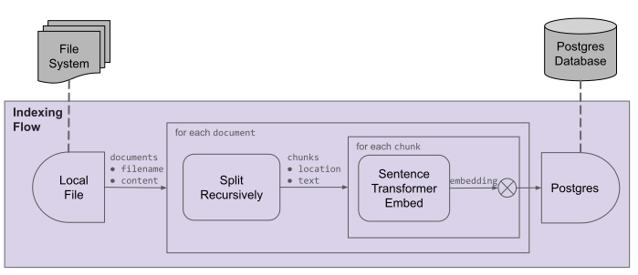
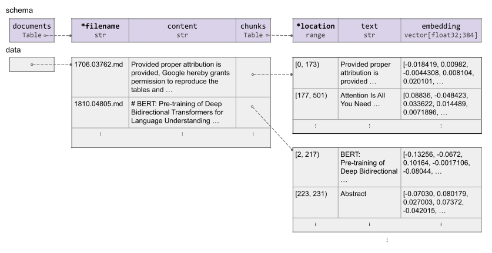

# CocoIndex Indexing Basics

An **index** is a collection of data stored in a way that is easy for retrieval.

CocoIndex is an ETL framework for building indexes from specified data sources, a.k.a. **indexing**. It also offers utilities for users to retrieve data from the indexes.

An **indexing flow** extracts data from specified data sources, upon specified transformations, and puts the transformed data into specified target for later retrieval.

## Indexing flow elements

An indexing flow has two aspects: data and operations on data.

### Data

An indexing flow involves source data and transformed data (either as an intermediate result or the final result to be put into targets). All data within the indexing flow has **schema** determined at flow definition time.

Each piece of data has a **data type**, falling into one of the following categories:

*   *Basic type*.
*   *Struct type*: a collection of **fields**, each with a name and a type.
*   *Table type*: a collection of **rows**, each of which is a struct with specified schema. A table type can be a *KTable* (which has a key field) or a *LTable* (ordered but without key field).

An indexing flow always has a top-level struct, containing all data within and managed by the flow.

See [Data Types](data_types) for more details about data types.

### Operations

An **operation** in an indexing flow defines a step in the flow. An operation is defined by:

*   **Action**, which defines the behavior of the operation, e.g. *import*, *transform*, *for each*, *collect* and *export*.
    See [Flow Definition](flow_def) for more details for each action.

*   Some actions (i.e. "import", "transform" and "export") require an **Operation Spec**, which describes the specific behavior of the operation, e.g. a source to import from, a function describing the transformation behavior, a target to export to (as an index).
    *   Each operation spec has a **operation type**, e.g. `LocalFile` (data source), `SplitRecursively` (function), `SentenceTransformerEmbed` (function), `Postgres` (target).
    *   CocoIndex framework maintains a set of supported operation types. Users can also implement their own.

"import" and "transform" operations produce output data, whose data type is determined based on the operation spec and data types of input data (for "transform" operation only).

## An indexing flow example

For the example shown in the [Quickstart](../getting_started/quickstart) section, the indexing flow is as follows:

This creates the following data for the indexing flow:

*   The `LocalFile` source creates a `documents` field at the top level, with `filename` (key) and `content` sub fields.
*   A "for each" action works on each document, with the following transformations:
    *   The `SplitRecursively` function splits content into chunks, adds a `chunks` field into the current scope (each document), with `location` (key) and `text` sub fields.
    *   A "collect" action works on each chunk, with the following transformations:
        *   The `SentenceTransformerEmbed` function embeds the chunk into a vector space, adding a `embedding` field into the current scope (each chunk).

This shows schema and example data for the indexing flow:

## Life cycle of an indexing flow

An indexing flow, once set up, maintains a long-lived relationship between data source and target. This means:

1.  The target created by the flow remain available for querying at any time

2.  As source data changes (new data added, existing data updated or deleted), data in the target are updated to reflect those changes,
    on certain pace, according to the update mode:

    *   **One time update**: Once triggered, CocoIndex updates the target data to reflect the version of source data up to the current moment.
    *   **Live update**: CocoIndex continuously reacts to changes of source data and updates the target data accordingly, based on various **change capture mechanisms** for the source.

    See more details in the [build / update target data](flow_methods#build--update-target-data) section.

3.  CocoIndex intelligently reprocesses to propagate source changes to target by:

    *   Determining which parts of the target data need to be recomputed
    *   Reusing existing computations where possible
    *   Only reprocessing the minimum necessary data

    This is known as **incremental processing**.

You can think of an indexing flow similar to formulas in a spreadsheet:

*   In a spreadsheet, you define formulas that transform input cells into output cells
*   When input values change, the spreadsheet recalculates affected outputs
*   You focus on defining the transformation logic, not managing updates

CocoIndex works the same way, but with more powerful capabilities:

* Instead of flat tables, CocoIndex models data in nested data structures, making it more natural to model complex data
* Instead of simple cell-level formulas, you have operations like "for each" to apply the same formula across rows without repeating yourself

This means when writing your flow operations, you can treat source data as if it were static - focusing purely on defining the transformation logic. CocoIndex takes care of maintaining the dynamic relationship between sources and target data behind the scenes.

## Internal storage

As an indexing flow is long-lived, it needs to store intermediate data to keep track of the states.
CocoIndex uses internal storage for this purpose.

Currently, CocoIndex uses Postgres database as the internal storage.
See [Settings](settings#databaseconnectionspec) for configuring its location, and `cocoindex setup` CLI command (see [CocoIndex CLI](cli)) creates tables for the internal storage.
