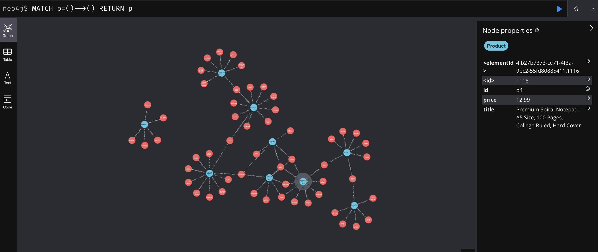
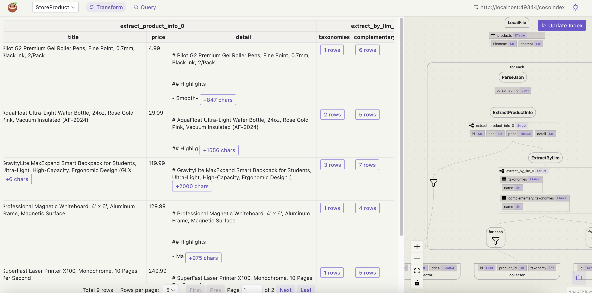

# Build Real-Time Recommendation Engine with LLM and Graph Database

We will build a real-time product recommendation engine with LLM and graph database. In particular, we will use LLM to understand the category (taxonomy) of a product. In addition, we will use LLM to enumerate the complementary products - users are likely to buy together with the current product (pencil and notebook).

We will use Graph to explore the relationships between products that can be further used for product recommendations or labeling.

Please drop [CocoIndex on Github](https://github.com/cocoindex-io/cocoindex) a star to support us and stay tuned for more updates. Thank you so much 🥥🤗. [](https://github.com/cocoindex-io/cocoindex)


## Prerequisite
*   [Install Postgres](https://cocoindex.io/docs/getting_started/installation#-install-postgres) if you don't have one.
*   Install [Neo4j](https://cocoindex.io/docs/ops/targets#neo4j-dev-instance) or [Kuzu](https://cocoindex.io/docs/ops/targets#kuzu-dev-instance) if you don't have one.
    *   The example uses Neo4j by default for now. If you want to use Kuzu, find out the "SELECT ONE GRAPH DATABASE TO USE" section and switch the active branch.
*   [Configure your OpenAI API key](https://cocoindex.io/docs/ai/llm#openai).

## Documentation
You can read the official CocoIndex Documentation for Property Graph Targets [here](https://cocoindex.io/docs/ops/targets#property-graph-targets).

## Run

### Build the index

Install dependencies:

```bash
pip install -e .
```

Setup:

```bash
cocoindex setup main.py
```

Update index:

```bash
cocoindex update main.py
```

### Browse the knowledge graph

After the knowledge graph is built, you can explore the knowledge graph.

* If you're using Neo4j, you can open the explorer at [http://localhost:7474](http://localhost:7474), with username `neo4j` and password `cocoindex`.
* If you're using Kuzu, you can start a Kuzu explorer locally. See [Kuzu dev instance](https://cocoindex.io/docs/ops/targets#kuzu-dev-instance) for more details.

You can run the following Cypher query to get all relationships:

```cypher
MATCH p=()-->() RETURN p
```



## CocoInsight
I used CocoInsight (Free beta now) to troubleshoot the index generation and understand the data lineage of the pipeline.
It just connects to your local CocoIndex server, with Zero pipeline data retention. Run following command to start CocoInsight:

```bash
cocoindex server -ci main.py
```

And then open the url https://cocoindex.io/cocoinsight.


