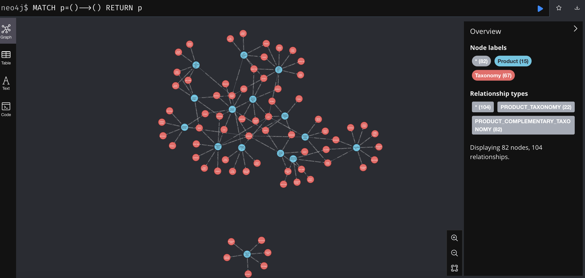
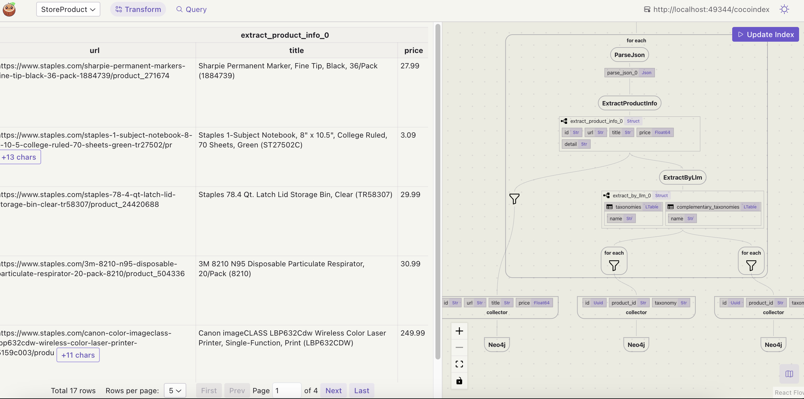

# Build Real-Time Product Recommendation based on LLM Taxonomy Extraction and Knowledge Graph

We will process a list of products and use LLM to extract the taxonomy and complimentary taxonomy for each product.

Please drop [CocoIndex on Github](https://github.com/cocoindex-io/cocoindex) a star to support us and stay tuned for more updates. Thank you so much 🥥🤗. [](https://github.com/cocoindex-io/cocoindex)


## Prerequisite
*   [Install Postgres](https://cocoindex.io/docs/getting_started/installation#-install-postgres) if you don't have one.
*   [Install Neo4j](https://cocoindex.io/docs/ops/storages#neo4j) if you don't have one.
*   [Configure your OpenAI API key](https://cocoindex.io/docs/ai/llm#openai).

## Documentation
You can read the official CocoIndex Documentation for Property Graph Targets [here](https://cocoindex.io/docs/ops/storages#property-graph-targets).

## Run

### Build the index

Install dependencies:

```bash
pip install -e .
```

Setup:

```bash
python main.py cocoindex setup
```

Update index:

```bash
python main.py cocoindex update
```

### Browse the knowledge graph

After the knowledge graph is built, you can explore the knowledge graph you built in Neo4j Browser.

For the dev enviroment, you can connect neo4j browser using credentials:
- username: `neo4j`
- password: `cocoindex`
which is pre-configured in the our docker compose [config.yaml](https://raw.githubusercontent.com/cocoindex-io/cocoindex/refs/heads/main/dev/neo4j.yaml).

You can open it at [http://localhost:7474](http://localhost:7474), and run the following Cypher query to get all relationships:

```cypher
MATCH p=()-->() RETURN p
```


## CocoInsight 
I used CocoInsight (Free beta now) to troubleshoot the index generation and understand the data lineage of the pipeline. 
It just connects to your local CocoIndex server, with Zero pipeline data retention. Run following command to start CocoInsight:

```bash
python main.py cocoindex server -ci
```

And then open the url https://cocoindex.io/cocoinsight. 




